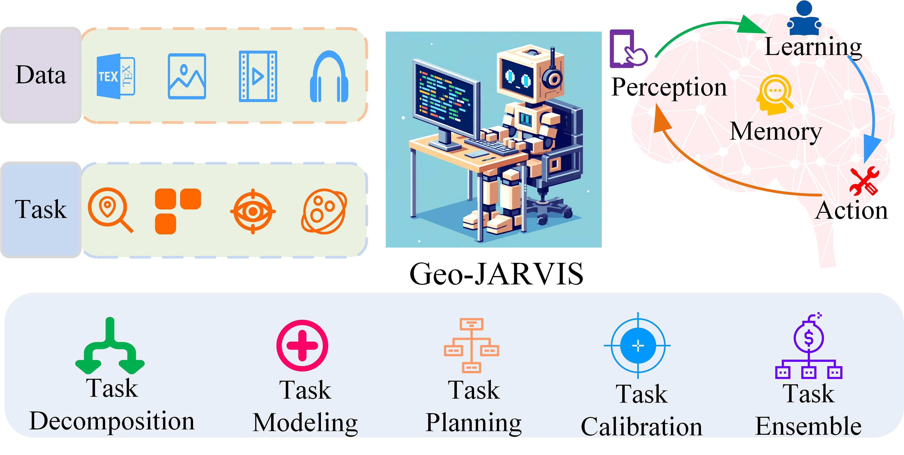
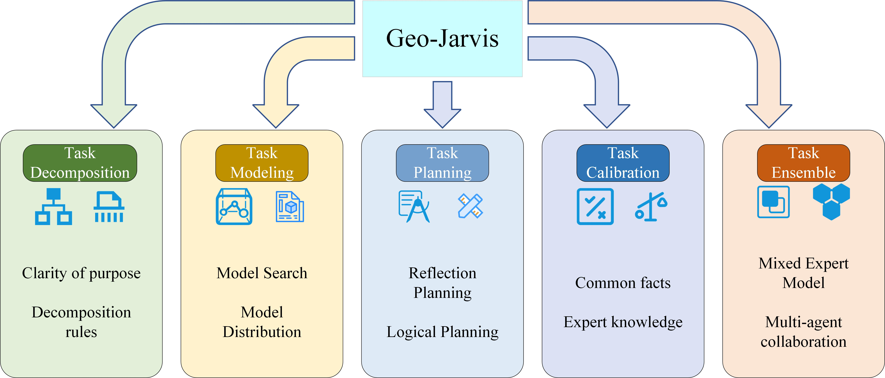

# LLM-Based AI-Agent-Paper-List for Geo-Jarvis Comprehensive Research

🍄‍🟫**Thinking of LLM-based AI-Agent**

🔥 **Must-read papers for LLM-based AI- Agents and Geo-science.**

🥟**Updating...**

## 🚗**News**

- 🚀[2025/08/22] We begin upload more papers!!
- 🚀[2024/01/04] We create this repository to maintain a paper list on LLM-based AI Agents. More papers are coming soon!

## ❣️ Introduction

Artificial intelligence-agent (AI-Agent) is considered to be a promising method to realize artificial general intelligence (AGI), 
and researchers hope that AI-Agent can realize the automation and intelligence of geographic information science exploration 
tasks through its general automation capabilities.

We propose a new architecture, Geo-JARVIS. It aims to automatically acquire geographic data through the form of AI-Agents 
and promote the development of new tools and new paradigms for geographic information science exploration and knowledge discovery. 
Geo-JARVIS is a humanoid agent that is understandable, memorable, plannable, and evolvable. 
From an abstract perspective, we define the four basic spaces that support Geo-JARVIS: instruction space, task space, 
model space, and data space, as well as its behavior space for task decomposition, 
task modeling, task planning, task calibration, and task combination that support basic spatial transformations.

### ❣️The core module

## 一、Comprehensive survey

(1) [A Survey on Large Language Model based Autonomous Agents](https://arxiv.org/abs/2308.11432)

(2) [Human-AI Symbiosis: A Survey of Current Approaches](https://arxiv.org/abs/2103.09990)

(3) [Interactive Natural Language Processing](https://arxiv.org/abs/2305.13246)

(4) [The Rise and Potential of Large Language Model Based Agents: A Survey](https://arxiv.org/abs/2309.07864)

(5) [Where are we in the search for an Artificial Visual Cortex for Embodied Intelligence?](https://arxiv.org/abs/2303.18240)

(6) [AGENT AI: SURVEYING THE HORIZONS OF MULTIMODAL INTERACTION](https://arxiv.org/abs/2401.03568)

(7) [If LLM Is the Wizard, Then Code Is the Wand: A Survey on How Code Empowers Large Language Models to Serve as Intelligent Agents](http://arxiv.org/abs/2401.00812)

## 二、Task Decomposition

(1) [Meditations on first philosophy](https://www.taylorfrancis.com/chapters/edit/10.4324/9781315508818-3/meditations-first-philosophy-ren%C3%A9-descartes)

(2) [Discourse on the Method](https://upload.wikimedia.org/wikipedia/commons/0/0b/Descartes%27_Discourse.pdf)

(3) [GOAT: GO to Any Thing](https://arxiv.org/abs/2311.06430)

(4) [Large language models for robotics: Opportunities, challenges, and perspectives](https://www.sciencedirect.com/science/article/pii/S2949855424000613)

(5) [DELTA: Decomposed Efficient Long-Term Robot Task Planning using Large Language Models](https://arxiv.org/abs/2404.03275)

(6) [DriveMLM: Aligning Multi-Modal Large Language Models with Behavioral Planning States for Autonomous Driving](https://arxiv.org/abs/2312.09245)

(7) [Driving with LLMs: Fusing Object-Level Vector Modality for Explainable Autonomous Driving](https://arxiv.org/abs/2310.01957)

(8) [A Language Agent for Autonomous Driving](https://arxiv.org/abs/2311.10813)

(9) [SelfGoal: Your Language Agents Already Know How to Achieve High-level Goals](https://arxiv.org/abs/2406.04784)

(10) [MLDT: Multi-Level Decomposition for Complex Long-Horizon Robotic Task Planning with Open-Source Large Language Model](https://arxiv.org/abs/2403.18760)

(11) [LMDrive: Closed-Loop End-to-End Driving with Large Language Models](https://arxiv.org/abs/2312.07488)

(12) [Training Verifiers to Solve Math Word Problems](https://arxiv.org/abs/2110.14168)

(13) [Measuring Mathematical Problem Solving With the MATH Dataset](https://arxiv.org/abs/2103.03874)

(14) [Are NLP Models really able to Solve Simple Math Word Problems?](https://arxiv.org/abs/2103.07191)

(15) [A Diverse Corpus for Evaluating and Developing English Math Word Problem Solvers](https://arxiv.org/abs/2106.15772)

(16) [MAWPS: A Math Word Problem Repository](https://aclanthology.org/N16-1136/)

(17) [Tree of Thoughts: Deliberate Problem Solving with Large Language Models](https://arxiv.org/abs/2305.10601)

(18) [Chain-of-Thought Prompting Elicits Reasoning in Large Language Models](https://arxiv.org/abs/2201.11903)

(19) [Large Language Models are Zero-Shot Reasoners](https://arxiv.org/abs/2205.11916)

(20) [Self-Consistency Improves Chain of Thought Reasoning in Language Models](https://arxiv.org/abs/2203.11171)

## 三、Task Modeling

(1) [ToolLLM: Facilitating Large Language Models to Master 16000+ Real-world APIs](https://arxiv.org/abs/2307.16789)

(2) [Tool Learning with Large Language Models: A Survey](https://arxiv.org/abs/2405.17935)

(3) [ToolChain*: Efficient Action Space Navigation in Large Language Models with A* Search](https://arxiv.org/abs/2310.13227)

(4) [ToolQA: A Dataset for LLM Question Answering with External Tools](https://arxiv.org/pdf/2306.13304)

(5) [ToolRerank: Adaptive and Hierarchy-Aware Reranking for Tool Retrieval](https://arxiv.org/abs/2403.06551)

(6) [HuggingGPT: Solving AI Tasks with ChatGPT and its Friends in Hugging Face](https://proceedings.neurips.cc/paper_files/paper/2023/hash/77c33e6a367922d003ff102ffb92b658-Abstract-Conference.html)

(7) [ControlLLM: Augment Language Models with Tools by Searching on Graphs](https://arxiv.org/pdf/2310.17796)

(8) [OpenAGI: When LLM Meets Domain Experts](https://proceedings.neurips.cc/paper_files/paper/2023/file/1190733f217404edc8a7f4e15a57f301-Paper-Datasets_and_Benchmarks.pdf)

(9) [Chain-of-experts: When llms meet complex operations research problems](https://chat.deepseek.com/)

(10) [AutoAgents: A Framework for Automatic Agent Generation](https://arxiv.org/abs/2309.17288)

## 四、Task Planning

(1) [Recommender AI Agent: Integrating Large Language Models for Interactive Recommendations](https://arxiv.org/pdf/2308.16505)

(2) [Reflexion: Language Agents with Verbal Reinforcement Learning](https://proceedings.neurips.cc/paper_files/paper/2023/file/1b44b878bb782e6954cd888628510e90-Paper-Conference.pdf)

(3) [Self-Refine: Iterative Refinement with Self-Feedback](https://proceedings.neurips.cc/paper_files/paper/2023/file/91edff07232fb1b55a505a9e9f6c0ff3-Paper-Conference.pdf)

(4) [Learning From Mistakes Makes LLM Better Reasoner](https://arxiv.org/pdf/2310.20689)

(5) [LLM+P: Empowering Large Language Models with Optimal Planning Proficiency](https://arxiv.org/pdf/2304.11477)

(6) [Toolformer: Language Models Can Teach Themselves to Use Tools](https://proceedings.neurips.cc/paper_files/paper/2023/file/d842425e4bf79ba039352da0f658a906-Paper-Conference.pdf)

(7) [ToolkenGPT: Augmenting Frozen Language Models with Massive Tools via Tool Embeddings](https://proceedings.neurips.cc/paper_files/paper/2023/file/8fd1a81c882cd45f64958da6284f4a3f-Paper-Conference.pdf)

## 五、Task Calibration

(1) [Hallucination of Multimodal Large Language Models: A Survey](https://arxiv.org/pdf/2404.18930?)

(2) [A survey on hallucination in large language models: Principles, taxonomy, challenges, and open questions](https://arxiv.org/pdf/2311.05232)

(3) [KnowAgent: Knowledge-Augmented Planning for LLM-Based Agents](https://arxiv.org/pdf/2403.03101)

(4) [A Survey on RAG Meeting LLMs: Towards Retrieval-Augmented Large Language Models](https://dl.acm.org/doi/pdf/10.1145/3637528.3671470)

(5) [RAG and RAU: A survey on retrieval-augmented language model in natural language processing](https://arxiv.org/pdf/2404.19543?)

(6) [Self-RAG: Learning to Retrieve, Generate, and Critique through Self-Reflection](https://par.nsf.gov/servlets/purl/10539591)

(7) [Dialogue Chain-of-Thought Distillation for Commonsense-aware Conversational Agents](https://arxiv.org/pdf/2310.09343)

(8) [CANDLE: Iterative Conceptualization and Instantiation Distillation from Large Language Models for Commonsense Reasoning](https://arxiv.org/pdf/2401.07286)

(9) [HellaSwag: Can a Machine Really Finish Your Sentence?](https://arxiv.org/pdf/1905.07830)

(10) [Commonsense Reasoning for Natural Language Processing](https://aclanthology.org/2020.acl-tutorials.7/)

(11) [Knowledge-to-SQL: Enhancing SQL Generation with Data Expert LLM](https://arxiv.org/abs/2402.11517)

(12) [On Large Language Models in National Security Applications](https://onlinelibrary.wiley.com/doi/am-pdf/10.1002/sta4.70057)

(13) [GEOLLM: EXTRACTING GEOSPATIAL KNOWLEDGE FROM LARGE LANGUAGE MODELS](https://arxiv.org/pdf/2310.06213)

(14) [An Autonomous GIS Agent Framework for Geospatial Data Retrieval](https://www.tandfonline.com/doi/full/10.1080/17538947.2025.2458688)

## 六、Task Ensemble

(1) [A Survey on Mixture of Experts in Large Language Models](https://arxiv.org/abs/2407.06204)

(2) [Multi-Agent Collaboration: Harnessing the Power of Intelligent LLM Agents](https://arxiv.org/pdf/2306.03314)

(3) [DeepSeekMoE: Towards Ultimate Expert Specialization in Mixture-of-Experts Language Models](https://arxiv.org/abs/2401.06066)

(4) [HyperMoE: Towards Better Mixture of Experts via Transferring Among Experts](https://arxiv.org/abs/2402.12656)

(5) [MVMoE: Multi-Task Vehicle Routing Solver with Mixture-of-Experts](https://arxiv.org/abs/2405.01029)

(6) [Too Many Cooks: Bayesian Inference for Coordinating Multi-Agent Collaboration](https://onlinelibrary.wiley.com/doi/full/10.1111/tops.12525)

(7) [CoAct: A Global-Local Hierarchy for Autonomous Agent Collaboration](https://arxiv.org/abs/2406.13381)

(8) [AgentVerse: Facilitating Multi-Agent Collaboration and Exploring Emergent Behaviors in Agents](https://cz5waila03cyo0tux1owpyofgoryroob.itic-sci.com/9C/54/B4/9C54B47616795A320E36FCB1EA595C91.pdf)

(9) [MetaGPT: Meta programming for a multi-agent collaborative framework](https://repository.kaust.edu.sa/items/84128c48-cfbc-4e41-96b0-5e7df879c1ab)

## Contact
- Xian Li: xian_zw@outlook.com
